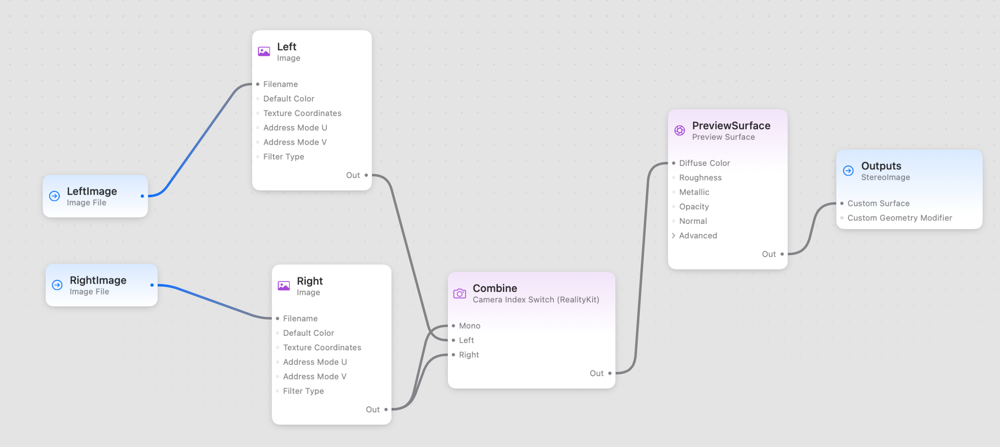
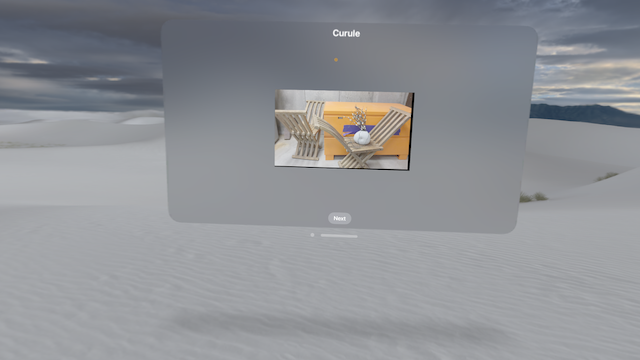

#  Stereo Image Display in visionOS

This sample project shows my current approach to displaying stereographic image pairs in visionOS. There are a few hiccups.

The shader graph is pretty straightforward. Two named `ImageFile` nodes ("LeftImage" and "RightImage") accept the names of the left and right images, feed to a pair of `Image` nodes, which then feed a `CameraIndexSwitch`. I feed the right image to the "Mono" input, because in the images I'm working with I'll occasionally see a missing left image. This pipeline then feeds a named output "StereoImage". As of visionOS 1.1, `TextureResource.load` fails with pure grayscale images, so you will have to convert them to an RGB-based color space (Apple FB 13733823). Size limit is 8192x8192 pixels.

The images are loaded in the `update:` closure of a `RealityView`. If you are updating a `RealityView`, you have some opportunities to write spectacular memory leaks. There are two versions of `StereoView`, which actually displays the 3D image. `StereoView_simple` is a direct approach. `StereoView_revised` has some optimizations. They are used respectively in the "SG Stereo simple" and "SG Stereo revised" targets and schemes. A 2D mesh `Entity` is used to display the stereo image.

You must load your image in the `RealityView`'s `make:` closure. You're not guaranteed to ever get a call to the `update:` closure. But if you change the image in a loaded `RealityView`, you _will_ get a call to your `update:` closure. However, the `update:` closure is called for every SwiftUI state change, not just image reloading. To solve this, I've put the logic to load an image pair into a separate function that's called from both the `make:` and the `update:` closures.

Build and run the app, and look at the Memory usage plot in Xcode or the Memory Instruments. In `StereoView_simple`, we load the images on every `update:` call, build a new `Material`, and update the image plane's `Material`. There's some sort of memory leak or hoarding when the material is updated. You can go from 55 megabytes of memory usage to a couple of gigabytes simply by resizing the window. In a prior version, I was rebuilding the mesh on every `update:`, and that was even more ridiculous.

In `StereoView_revised`, we set the image plane's name to be the stereo pair's `id`, and then check to see if the image we're loading is the same one we've loaded. This vastly reduces the memory leakage, because now we're only leaking when we change images.

The 3D image is a fixed size, because a mesh Entity's size is specified in meters. A nice enhancement would be to resize the image plane when the window is resized, using either a new Entity, or the Entity's' transform.

Stereo pairs courtesy of [Middlebury College](https://vision.middlebury.edu/stereo/data/scenes2021/).
