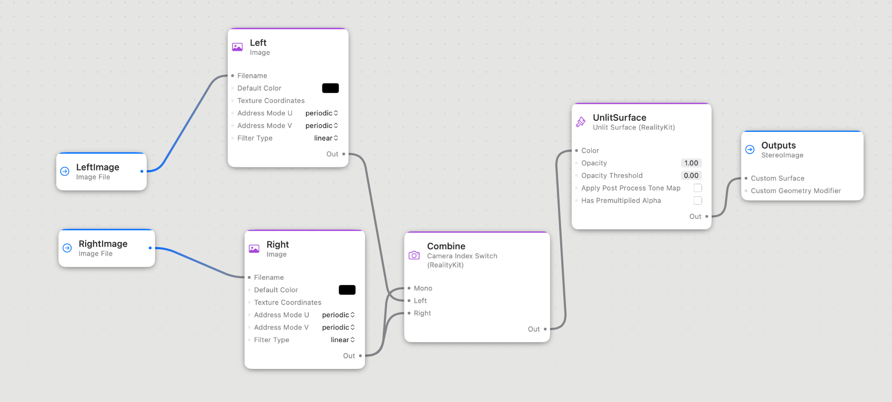

#  Stereo Image Display in visionOS

This sample project shows my current approach to displaying stereographic image pairs in visionOS. There are a few hiccups.

The shader graph is pretty straightforward. Two named `ImageFile` nodes ("LeftImage" and "RightImage") accept the names of the left and right images, feed to a pair of `Image` nodes, which then feed a `CameraIndexSwitch`. I feed the right image to the "Mono" input, because in the image pairs I'm working with I'll occasionally encounter a missing left image. This pipeline then feeds a named output "StereoImage". In releases through visionOS 2.2, and still in Xcode 16.2's visionOS 2.2 SDK, `TextureResource.load` fails with pure grayscale images, so you will have to convert them to an RGB-based color space (Apple FB 13733823). Size limit is 8192x8192 pixels.

Early versions of the visionOS SDK had severe memory leaks when using the `CameraIndexSwitch`. As of Xcode 16.2/visionOS 2.3 beta, these are resolved. This repo contains two versions of the `StereoView` View, which is what actually displays the 3D image. `StereoView_simple` is a direct approach. `StereoView_revised` has some optimizations. They are used respectively in the "SG Stereo simple" and "SG Stereo revised" targets and schemes. A 2D mesh `Entity` is used to display the stereo image. In visionOS 1.0, `StereoView_simple` leaked like a sieve, and `StereoView_revised` leaked a little bit; visionOS 2.2 makes it all better. I didn't test intervening versions.

You must load your image in the `RealityView`'s `make:` closure. You're not guaranteed to ever get a call to the `update:` closure. But if you change the image in a loaded `RealityView`, you _will_ get a call to your `update:` closure. However, the `update:` closure is called for every SwiftUI state change, not just image reloading. To solve this, I've put the logic to load an image pair into a separate function that's called from both the `make:` and the `update:` closures.

In `StereoView_revised`, we set the image plane's name to be the stereo pair's `id`, and then check to see if the image we're loading is the same one we've loaded. This vastly reduces the memory leakage, because now we're only leaking when we change images. I'm not thrilled about writing state to the RealityView entity this way, but it works. Apple FB 13817928 for the smaller leakage.

The plane that shows the 3D image is a fixed size, because a mesh Entity's size is specified in meters. A nice enhancement would be to resize the image plane when the window is resized, using either a new Entity, or the Entity's' transform. That's why the Ames Stereo Pipeline sample's aspect ratio is wrong.

Stereo pairs courtesy of [Middlebury College](https://vision.middlebury.edu/stereo/data/scenes2021/) and Nasa Ames Stereo Pipeline (https://github.com/NeoGeographyToolkit/StereoPipeline/).
